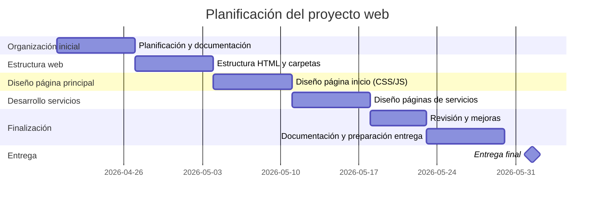

## Planificación del proyecto (Gantt)

```mermaid
gantt
  title Planificación del proyecto web
  dateFormat YYYY-MM-DD

  section Organización inicial
  Planificación y documentación        :a1, 2026-04-20, 7d

  section Estructura web
  Estructura HTML y carpetas           :a2, 2026-04-27, 7d

  section Diseño página principal
  Diseño página inicio (CSS/JS)        :a3, 2026-05-04, 7d

  section Desarrollo servicios
  Diseño páginas de servicios          :a4, 2026-05-11, 7d

  section Finalización
  Revisión y mejoras                   :a5, 2026-05-18, 5d
  Documentación y preparación entrega  :a6, after a5, 7d

  section Entrega
  Entrega final                        :milestone, a7, 2026-06-01, 1d
```