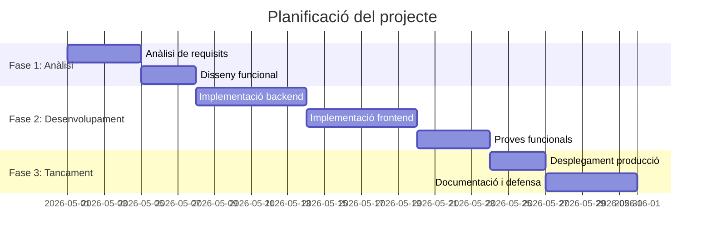

## Planificació del projecte (Gantt)

```mermaid
gantt
  title Planificació del projecte
  dateFormat YYYY-MM-DD

  section Fase 1: Anàlisi
  Anàlisi de requisits     :a1, 2026-05-01, 4d
  Disseny funcional        :a2, after a1, 3d

  section Fase 2: Desenvolupament
  Implementació backend    :b1, after a2, 6d
  Implementació frontend   :b2, after b1, 6d
  Proves funcionals        :b3, after b2, 4d

  section Fase 3: Tancament
  Desplegament producció   :c1, after b3, 3d
  Documentació i defensa   :c2, after c1, 5d
```