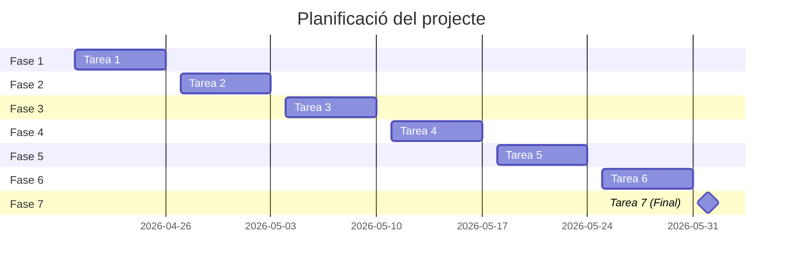

# 🚀 JobReady CV
> **Optimización de CV mediante Inteligencia Artificial y validación por expertos.**

---

## 👥 Integrantes del proyecto
* **Yang Zhang** — *Líder de Proyecto y Desarrollador*

## 🎯 Objetivos
El objetivo principal es desarrollar una plataforma web que combine la potencia de la **IA** con el criterio de **profesionales del sector** para corregir currículums, facilitando así la inserción laboral de los usuarios.

## 📝 Explicación del Proyecto
**JobReady AI** es una solución tecnológica diseñada para combatir la invisibilidad de los CV genéricos en los procesos de selección actuales (ATS).

* **Público objetivo:** Universitarios de último año y recién graduados (20-30 años).
* **Propuesta de valor:** Transformar perfiles básicos en candidaturas competitivas mediante análisis inteligente y feedback experto.

---

## 🛠️ Material del Proyecto

### 💻 Maquinaria (Hardware)
- **Ordenador personal:** Estación de trabajo para desarrollo y programación.
- **Conexión a internet:** Acceso necesario para la integración de APIs de IA y gestión de repositorios.

### ⚙️ Programario (Stack Tecnológico)
* **HTML5:** Para estructurar el contenido de la web (formularios de subida de CV, secciones de información).
* **CSS3:** Para el diseño visual, asegurando que la página sea atractiva y fácil de usar (posibilidad de usar **Tailwind** para agilizar el desarrollo).
* **JavaScript (JS):** Para dar interactividad a la página y conectar la web con la **API de OpenAI**.
* **VS Code:** Editor de código (Visual Studio Code).
* **GitHub Pages:** Servidor de pruebas y despliegue gratuito.

---

## 📅 Planificación

## Webgrafía
adadadad

## Anexos
adadaad