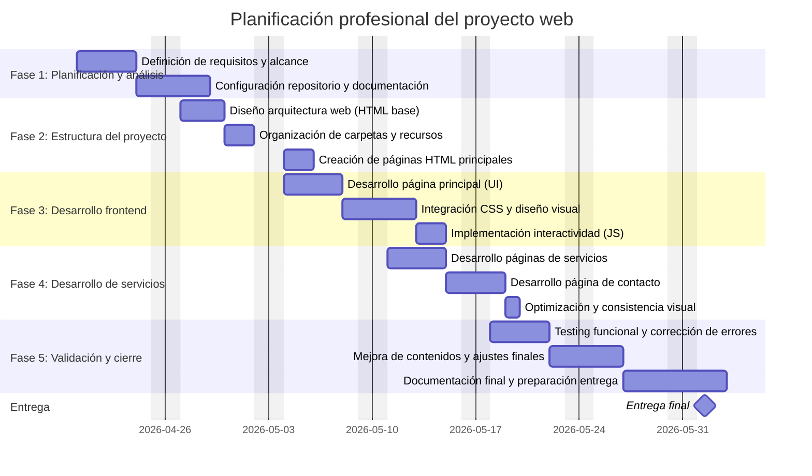

## Planificación del proyecto (Gantt)

```mermaid
gantt
  title Planificación profesional del proyecto web
  dateFormat YYYY-MM-DD
  excludes weekends

  section Fase 1: Planificación y análisis
  Definición de requisitos y alcance        :a1, 2026-04-20, 4d
  Configuración repositorio y documentación :a2, after a1, 3d

  section Fase 2: Estructura del proyecto
  Diseño arquitectura web (HTML base)       :b1, 2026-04-27, 3d
  Organización de carpetas y recursos       :b2, after b1, 2d
  Creación de páginas HTML principales      :b3, after b2, 2d

  section Fase 3: Desarrollo frontend
  Desarrollo página principal (UI)          :c1, 2026-05-04, 4d
  Integración CSS y diseño visual           :c2, after c1, 3d
  Implementación interactividad (JS)        :c3, after c2, 2d

  section Fase 4: Desarrollo de servicios
  Desarrollo páginas de servicios           :d1, 2026-05-11, 4d
  Desarrollo página de contacto             :d2, after d1, 2d
  Optimización y consistencia visual        :d3, after d2, 1d

  section Fase 5: Validación y cierre
  Testing funcional y corrección de errores :e1, 2026-05-18, 4d
  Mejora de contenidos y ajustes finales    :e2, after e1, 3d
  Documentación final y preparación entrega :e3, after e2, 5d

  section Entrega
  Entrega final                             :milestone, f1, 2026-06-01, 1d
```